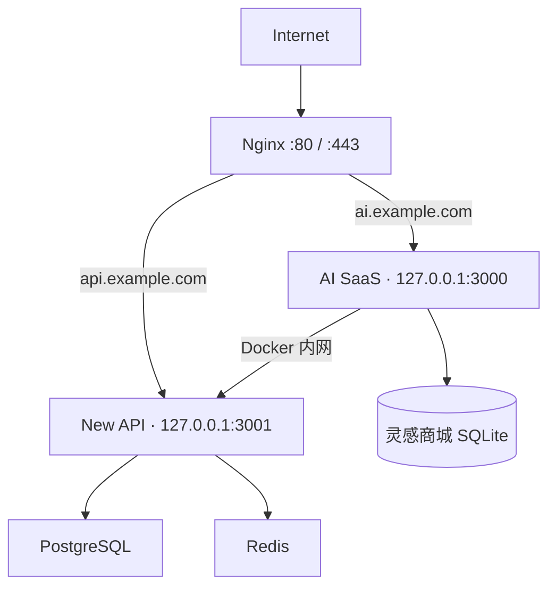

# 灵智云 AI SaaS + New API 一体化部署手册

本部署栈同时启动：

- 灵智云 AI SaaS 前端与运营后台
- New API 模型网关
- PostgreSQL 15
- Redis 7.4

New API 官方文档推荐生产环境使用 PostgreSQL；Redis 用于会话、缓存和限流。数据库和 Redis 仅在 Docker 内网通信。

## 1. 服务器准备

推荐配置：

- Ubuntu 22.04/24.04
- 2 核 CPU、4 GB 内存及以上
- 30 GB 以上可用磁盘
- Docker Engine 24+、Docker Compose v2
- 两个已解析到服务器的域名，例如 `ai.example.com`、`api.example.com`

安全组只开放：

- `22/tcp`：SSH，建议限制来源 IP
- `80/tcp`：HTTP
- `443/tcp`：HTTPS

3000、3001、5432、6379 均不需要开放公网。

## 2. 安装 Docker

```bash
curl -fsSL https://get.docker.com | sh
sudo systemctl enable --now docker
sudo usermod -aG docker "$USER"
```

重新登录 SSH 后确认：

```bash
docker version
docker compose version
```

## 3. Linux 一键部署

```bash
git clone https://github.com/1468848161/AI.git
cd AI
bash scripts/deploy.sh
```

首次运行会自动创建权限为 `600` 的 `.env`，并随机生成：

- PostgreSQL 密码
- Redis 密码
- New API `SESSION_SECRET`
- New API `CRYPTO_SECRET`

再次运行脚本不会覆盖已有密钥。

查看状态：

```bash
docker compose --env-file .env ps
docker compose --env-file .env logs --tail=100
```

所有服务应最终变为 `healthy`。

## 4. Windows 一键部署

先安装 Docker Desktop、Git，然后在 PowerShell 中执行：

```powershell
git clone https://github.com/1468848161/AI.git
cd AI
powershell -ExecutionPolicy Bypass -File .\scripts\deploy.ps1
```

Windows 本机可直接访问：

- AI SaaS：`http://127.0.0.1:3000`
- New API：`http://127.0.0.1:3001`

## 5. 初始化 New API

服务器上的端口仅监听 `127.0.0.1`。配置域名前，可以从自己的电脑建立 SSH 隧道：

```bash
ssh -L 3000:127.0.0.1:3000 -L 3001:127.0.0.1:3001 user@server-ip
```

打开 `http://127.0.0.1:3001`：

1. 完成 New API 首次管理员初始化；
2. 在“渠道”中添加 OpenAI、Anthropic、Gemini、DeepSeek 等上游；
3. 在“模型”或渠道映射中确认前端使用的模型名称；
4. 创建一个只供 AI SaaS 服务端使用的专用令牌；
5. 为该令牌设置合理的模型范围、额度和过期时间。

编辑 `.env`：

```env
NEW_API_ADMIN_TOKEN=sk-你的前端专用令牌
```

重建前端容器，让服务端读取令牌：

```bash
docker compose --env-file .env up -d --force-recreate ai-saas
```

检查代理接口：

```bash
curl http://127.0.0.1:3000/api/models
```

## 6. 配置 Nginx

安装：

```bash
sudo apt update
sudo apt install -y nginx
```

复制仓库内模板：

```bash
sudo cp deploy/nginx-ai-saas.conf.example /etc/nginx/sites-available/ai-saas
sudo nano /etc/nginx/sites-available/ai-saas
```

分别替换：

- `ai.example.com`：用户前端域名
- `api.example.com`：New API 管理和开放接口域名

启用配置：

```bash
sudo ln -s /etc/nginx/sites-available/ai-saas /etc/nginx/sites-enabled/ai-saas
sudo nginx -t
sudo systemctl reload nginx
```

## 7. 配置 HTTPS

```bash
sudo apt install -y certbot python3-certbot-nginx
sudo certbot --nginx -d ai.example.com -d api.example.com
sudo certbot renew --dry-run
```

HTTPS 生效后，编辑 `.env`：

```env
NEW_API_SESSION_COOKIE_SECURE=true
NEW_API_SESSION_COOKIE_TRUSTED_URL=https://api.example.com
```

`NEW_API_SESSION_COOKIE_TRUSTED_URL` 必须是精确 HTTPS Origin，不要填写路径或通配符。

重建 New API：

```bash
docker compose --env-file .env up -d --force-recreate new-api
docker compose --env-file .env up -d --force-recreate ai-saas
```

## 8. 网络与数据结构



持久化卷：

| 卷 | 内容 |
|---|---|
| `postgres_data` | 用户、渠道、令牌、额度、订单和调用记录 |
| `redis_data` | Redis AOF、缓存与会话数据 |
| `new_api_data` | New API 本地运行数据 |
| `new_api_logs` | New API 文件日志 |
| `ai_saas_data` | 灵感模板售价、用户余额、购买授权、订单与资金流水 |

停止服务但保留数据：

```bash
docker compose --env-file .env down
```

不要执行 `docker compose down -v`，除非明确要永久删除所有数据。

## 9. 数据备份

执行：

```bash
bash scripts/backup-stack.sh
```

脚本会生成两个一致性备份：

- `backups/new-api-时间.sql.gz`：New API PostgreSQL；
- `backups/ai-saas-commerce-时间.sqlite`：灵感商城售价、余额、订单与授权。

文件权限受当前用户和 `umask 077` 保护。建议每天执行并同步到另一台服务器或对象存储。

恢复数据库会覆盖现有业务数据。维护窗口内执行：

```bash
docker compose --env-file .env stop ai-saas new-api
gunzip -c backups/new-api-YYYYMMDDTHHMMSSZ.sql.gz \
  | docker compose --env-file .env exec -T postgres \
      sh -c 'psql -U "$POSTGRES_USER" "$POSTGRES_DB"'
docker compose --env-file .env start new-api ai-saas
```

恢复灵感商城会覆盖当前售价、余额、购买授权和订单。先停止前端，再把确认过的快照写回持久化卷：

```bash
docker compose --env-file .env stop ai-saas
docker compose --env-file .env run --rm --no-deps --user root \
  -v "$PWD/backups/ai-saas-commerce-YYYYMMDDTHHMMSSZ.sqlite:/restore.sqlite:ro" \
  ai-saas node -e 'const f=require("node:fs");for(const s of ["","-wal","-shm"]){try{f.unlinkSync("/app/data/commerce.sqlite"+s)}catch(e){if(e.code!=="ENOENT")throw e}}f.copyFileSync("/restore.sqlite","/app/data/commerce.sqlite");f.chownSync("/app/data/commerce.sqlite",1001,1001)'
docker compose --env-file .env start ai-saas
```

恢复前应先对当前数据库再做一次备份。

## 10. 整体升级

先备份：

```bash
bash scripts/backup-stack.sh
```

再升级：

```bash
git pull --ff-only
bash scripts/update-stack.sh
```

查看：

```bash
docker compose --env-file .env ps
docker compose --env-file .env logs -f --tail=200
```

默认 `NEW_API_IMAGE=calciumion/new-api:latest`。商业生产建议先在测试环境验证，然后把 `.env` 中的镜像改成经过验证的固定版本标签，再执行升级。

## 11. 前端单独开发

```bash
corepack enable
corepack prepare pnpm@11.25.0 --activate
pnpm install --frozen-lockfile
cp .env.example .env.local
```

修改 `.env.local`：

```env
NEW_API_BASE_URL=http://127.0.0.1:3001
NEW_API_ADMIN_TOKEN=sk-your-token
SAAS_SESSION_SECRET=至少64位随机十六进制字符串
SAAS_ADMIN_KEY=后台灵感商品管理密钥
SAAS_DATABASE_PATH=storage/commerce.sqlite
SAAS_COOKIE_SECURE=false
```

启动：

```bash
pnpm dev
```

## 12. Cloudflare/Sites 部署说明

`pnpm build:sites` 只构建 AI SaaS 展示前端，不能把 PostgreSQL、Redis、Node SQLite 灵感交易层和 New API 一起部署到 Cloudflare Worker。云端前端必须为交易接口另接兼容数据库，并把 `NEW_API_BASE_URL` 配置成公网 HTTPS New API 地址。

完整的一体化部署请使用本仓库 Docker Compose。

## 13. 常见问题

### New API 一直不健康

```bash
docker compose --env-file .env logs --tail=200 new-api postgres redis
```

重点检查 `.env` 是否仍有 `CHANGE_ME_` 占位符，以及数据库、Redis 是否健康。

### 前端返回 New API 401

在 New API 中重新创建专用令牌，更新 `NEW_API_ADMIN_TOKEN`，然后重建 `ai-saas`。

### 前端返回 502

```bash
docker compose --env-file .env exec ai-saas \
  wget -q -O - http://new-api:3000/api/status
```

若容器内可以访问 New API，再检查渠道、模型名称和上游密钥。

### Nginx 返回 502

```bash
curl -I http://127.0.0.1:3000
curl -I http://127.0.0.1:3001
sudo nginx -t
```

### 修改 `.env` 未生效

```bash
docker compose --env-file .env up -d --force-recreate
```

## 14. 上线检查清单

- [ ] `.env` 不在 Git 追踪列表中
- [ ] 所有 `CHANGE_ME_` 占位符均已替换
- [ ] PostgreSQL、Redis 未开放公网端口
- [ ] 前端和 New API 只监听 `127.0.0.1`
- [ ] 两个域名都已启用 HTTPS
- [ ] New API 已启用 Secure Cookie 并配置可信 Origin
- [ ] 前端使用独立、限额、可撤销的 New API Token
- [ ] New API 渠道密钥只保存在服务端
- [ ] `SAAS_SESSION_SECRET` 与 `SAAS_ADMIN_KEY` 已随机生成且未泄露
- [ ] `SAAS_COOKIE_SECURE=true`（HTTPS 正式环境）
- [ ] 已验证 PostgreSQL 与灵感商城 SQLite 的备份和恢复流程
- [ ] 已设置监控、磁盘告警、日志轮转和异地备份
